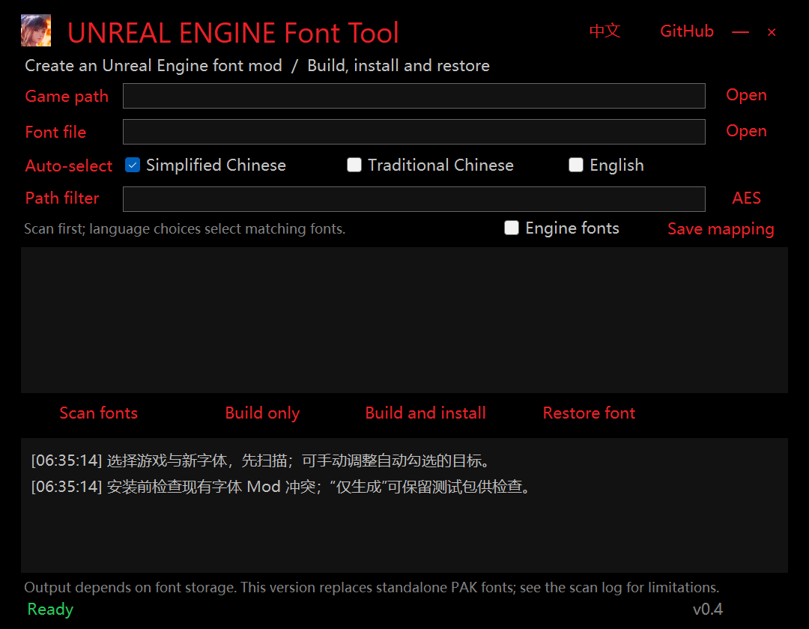

# UNREAL ENGINE Font Tool

[简体中文](README.md) · [Download / Releases](https://github.com/jakeouyang/UEFontTool/releases) · [Changelog](CHANGELOG.md)

A Windows desktop tool for scanning standalone fonts in Unreal Engine games and building, installing, and restoring replacement font PAK mods. Built with C# / .NET 8 / WinForms, with Chinese and English interfaces.



## Download and use

Download `UEFontTool-vVERSION-win-x64.zip` from **Releases**, extract the complete archive, and run `UEFontTool.exe`. Keep the adjacent `tools` folder. The .NET runtime is included; Python and Unreal Editor are not required. GitHub's automatic Source code downloads are not runnable builds.

1. Select the game root or its exact `Content/Paks` directory, and a replacement TTF/OTF.
2. For encrypted games, click **AES** and paste 64 hexadecimal digits (optional `0x`) or a Base64-encoded 32-byte key. Input is masked by default, kept for this session only, and not written to settings or logs. Apply an empty field to clear it.
3. Scan, then select Simplified Chinese, Traditional Chinese, or English. Review the paths selected by known mappings and explicit language markers.
4. Adjust the targets manually if needed. With exactly one language selected, click **Save mapping**. Right-click it to restore automatic matching. Engine fonts are hidden by default. Filtering does not clear selections; the hidden selection count is shown.
5. **Build only** creates and reads back the package. **Build and install** additionally checks detected mod conflicts.
6. **Restore font** removes only an installation matching this tool's recorded path and hash.

Settings, output and installation records live in the adjacent `data/` folder. Each build includes a PAK and `manifest.json` with target paths, hashes, character coverage differences, and output PAK version. Keep installation records for restoration.

## Supported scope

| Storage / scenario | Current support |
| --- | --- |
| Standalone `.ttf`, `.otf`, `.ufont` in standard PAKs | Scan, extract, replace, pack, and verify by reading back |
| Encrypted PAKs | Requires a user-supplied matching AES key; custom formats may need an adapter |
| Black Myth: Wukong custom PAKs | Adapter for the observed v11 layout; runtime loading remains game-specific |
| DragonSword: Awakening custom PAKs | Adapter for observed v101 encrypted/masked indexes; generates standard V11 PAKs |
| Engine fallback fonts | Optional manual selection; excluded from automatic matching |
| Embedded FontFace / IoStore resource rewriting | **Not implemented** |
| Offline font atlases, TTC, automatic glyph fallback generation | **Not implemented** |

This is not universal UE4/UE5 support. Reading an archive, building a valid package, and seeing the replacement in-game are separate validation stages. Font-folder `.uasset` files are only reported as candidates. IoStore containers are counted, but their internal font resources are not inspected.

Local samples of Wukong, Hogwarts Legacy, and Lords of the Fallen have passed standalone font extraction and package readback. The latter two use IoStore, but the tested fonts were in PAKs. A DragonSword sample scanned 54 original v101 archives plus six standard mod PAKs, found 45 standalone fonts including Engine fonts, and passed extraction/build/readback for one target. These are **not visual in-game confirmations**, and updates may change layouts.

## Troubleshooting

### DragonSword still reports V0 / magic errors after supplying AES

Older versions asked repak to probe standard layouts. Its final `trying version V0 failed` message does not identify the game's real version. The observed original archives use custom version **101**, with additional index, string, and entry masking after AES decryption. v0.4 adds a dedicated reader and verifies the key against the primary index SHA-1.

The stored transformed directory does not directly match its recorded directory hash. The adapter instead validates paths, index ranges and extraction results. Not every possible game variation or non-encoded font entry is supported.

The observed Chinese fonts are named `NotoSansTC`; automatic matching therefore suggests Traditional Chinese. Whether the Simplified Chinese UI references those same resources must be confirmed manually before saving a mapping.

### Is a PAK sufficient? What about signatures?

The answer depends on where the font bytes live. Standalone PAK fonts can often be overridden by a PAK. Embedded FontFace bytes require resource rewriting. IoStore resources require compatible containers and dependency handling. Offline font atlases also involve textures and glyph metrics.

Signature checking is separate. Copying an original `.sig` does not sign a changed mod. Signature Bypass and `-fileopenlog` are game/version-specific approaches, not universal solutions. This project includes no game AES keys, game fonts, or bypass DLLs, and does not automatically modify game executables. The Wukong test-launch link only asks Steam to start with `-fileopenlog`; it does not change permanent launch settings.

### Oodle extraction fails

Oodle is not redistributed. If needed, supply a legally obtained compatible `tools/oo2core_9_win64.dll` yourself. Index scanning may work without it while extraction/building needs it. Do not commit this DLL.

### Language matching, conflicts, and missing glyphs

Language names are recommendations, not resolved UI/subtitle references. Replacement fonts with smaller character coverage may cause missing glyphs or fallback. Coverage differences are reported; missing glyphs are not generated. Mod conflict checks mainly cover Paks subdirectories and cannot reliably distinguish third-party root-level mods from official archives. Unreadable existing mods block installation; inspect the scan report.

## Build from source

Requires Windows x64, .NET 8 SDK, and PowerShell 7.

```powershell
git clone git@github.com:jakeouyang/UEFontTool.git
cd UEFontTool
./scripts/Build.ps1
```

The script downloads a pinned repak release, verifies SHA-256, publishes a self-contained application, runs synthetic tests, and packages an explicit file allowlist. Local `data/`, AES keys, game files, Oodle, and experiments are excluded.

```powershell
./scripts/Get-Dependencies.ps1
dotnet build UEFontTool/UEFontTool.csproj -c Release
dotnet UEFontTool/bin/Release/net8.0-windows/UEFontTool.dll --self-test test-results.txt
```

Tests use synthetic PAKs and test-only keys; no game is required.

## GitHub Actions and Releases

Pushes to `main`, pull requests, and manual workflow runs build/test the application and upload a Windows ZIP with SHA-256. Pushing a `v*` tag matching the project version publishes those artifacts to **GitHub Releases**. For project version `0.4.0`, use tag `v0.4.0`. The workflow uses the repository's `GITHUB_TOKEN`; no personal token or SSH private key belongs in the repository.

## Command line

```text
UEFontTool.exe scan "GAME_DIR" "scan.json"
UEFontTool.exe build "GAME_DIR" "FONT.ttf" "build.json" "Game/Content/Fonts/Font.ufont"
UEFontTool.exe restore "GAME_DIR"
UEFontTool.exe diagnose-wukong "GAME_DIR"
```

Supply encrypted-game keys through the process environment variable `UEFONTTOOL_AES_KEY`. Omitting build targets uses the game's Simplified Chinese mapping. CLI build never installs.

The UI does not persist AES keys, but generic PAK operations pass the key to a local repak subprocess; software with local process-inspection permissions may read it. Settings, scans, and build manifests contain local paths. Redact them before sharing reports.

## License and contributions

Project code is [MIT licensed](LICENSE). See [THIRD_PARTY.md](THIRD_PARTY.md) for dependencies, format references, and their licenses. Game assets and fonts remain the property of their respective owners and are not distributed here.
When opening an issue, include game version, container format, redacted errors, and reproduction steps. Do not post keys, credentials, original game resources, or personal directory information.
