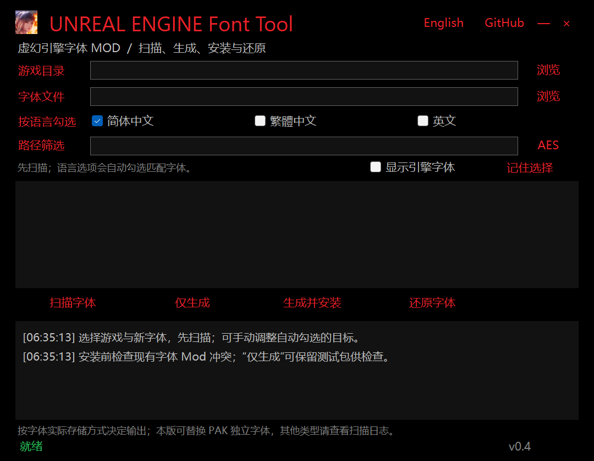

# UNREAL ENGINE Font Tool

[English](README.en.md) · [下载 / Releases](https://github.com/jakeouyang/UEFontTool/releases) · [更新记录](CHANGELOG.md)

Windows 桌面工具：扫描虚幻引擎游戏中的独立字体，选择新 TTF/OTF，生成、安装和还原字体 PAK Mod。
采用 C# / .NET 8 / WinForms，支持中文和英文界面。



## 下载运行

从 **Releases** 下载 `UEFontTool-v版本-win-x64.zip`，完整解压后运行 `UEFontTool.exe`。请保留同目录的 `tools` 文件夹。自带 .NET 运行时，不需要 Python 或完整 Unreal Editor。
GitHub 自动生成的 Source code 压缩包是源码，不是可直接运行的软件。

## 使用

1. 选择游戏根目录或准确的 `Content/Paks` 目录，以及新 TTF/OTF 字体。
2. 加密游戏点击 **AES**，直接粘贴 64 位十六进制密钥（可带 `0x`）或表示 32 字节的 Base64。输入默认遮蔽，仅在本次程序会话中使用，不写入配置或日志；留空可清除。
3. 点击“扫描字体”。选择简体、繁体、英文，列表会按已知映射及明确的语言路径标记勾选；请检查实际目标。
4. 手动调整后，只选择一种语言，点击“记住选择”。右键该按钮可恢复自动识别。Engine 字体默认隐藏；路径筛选不会取消已勾选项，界面会显示隐藏的已选数量。
5. “仅生成”生成并回读校验；“生成并安装”还会检查已识别的字体 Mod 冲突。
6. “还原字体”仅删除本工具记录中路径、哈希一致的安装文件。
7. “导出字体”把勾选的原字体导出为 TTF/OTF 等真实字体文件（自动识别语言与格式，便于确认目标字体）。

输出、设置和安装记录保存在程序旁的 `data/`。每次构建保留 PAK 和 `manifest.json`，包括目标路径、SHA-256、字符覆盖差异与输出 PAK 版本。保留安装记录才能可靠还原。

## 兼容范围

| 场景 | 当前支持 |
| --- | --- |
| 标准 PAK 中独立 `.ttf`、`.otf`、`.ufont` | 扫描、提取、替换、打包、回读校验 |
| 加密 PAK | 需用户提供正确 AES；某些游戏还需定制格式适配 |
| 黑神话：悟空特殊 PAK | 已适配 footer 与条目布局，输出自动转换并经游戏内验证（未压缩条目） |
| DragonSword: Awakening 特殊 PAK | 已适配观测到的 v101 加密/混淆索引；输出标准 V11 PAK |
| Engine 回退字体 | 可手动显示与勾选，默认不自动替换 |
| 内嵌 FontFace / IoStore 内部资源重写 | **尚不支持** |
| 离线字体图集、TTC、自动补字 | **尚不支持** |

不能保证所有 UE4/UE5 游戏兼容。容器读取成功、打包成功与游戏内加载生效是不同的验证阶段。
字体目录中的 `.uasset` 仅作为候选提示；IoStore 仅统计容器数量，不解析其内部字体资源。

本机样本曾验证悟空、霍格沃茨之遗、堕落之主的独立字体提取与打包。后两款存在 IoStore，但测试目标仍在 PAK 中。DragonSword 样本的 54 个原版 v101 PAK 和 6 个标准 Mod PAK 均可扫描，找到 45 个独立字体（含 Engine），并完成一个字体目标的提取、构建和回读。这些记录**不等于游戏内视觉验证**，游戏更新也可能改变格式。

## 常见问题

### DragonSword 导入 AES 仍提示 V0 / magic 错误？

旧版交给 repak 尝试通用版本，最终打印的 `trying version V0 failed` 不是在说游戏一定是 V0。观测到的原版使用自定义版本 **101**，AES 解密后还有索引、字符串和条目混淆，因此仅输入正确 AES 也不够。v0.4 加入专用读取器，并用原版主索引 SHA-1 验证密钥。

该格式的目录哈希不能直接用于验证存储的混淆数据，目前会检查路径、索引范围和提取结果。未实现所有可能的游戏变体或非编码字体条目。

样本中中文资源命名为 `NotoSansTC`，通用规则将其推荐为繁体；不会因为选择简体就盲目勾选它。简体界面是否也引用这些资源，需要手动确认后保存映射。

### 只有 PAK 就够了吗？签名怎么办？

取决于目标字体的存储位置。独立字体在 PAK 内，通常可以用 PAK 覆盖；内嵌 FontFace 需要重写资源，IoStore 资源还需要兼容的容器和依赖处理。字体离线图集则涉及纹理与字形度量。

`.sig` 属于签名验证层，复制官方签名不能给新 Mod 签名。悟空的输出会自动转换为游戏运行时布局（自定义 footer 与条目对齐），当前 Steam 版本无需 `-fileopenlog`（发行版已不实现该参数）或第三方签名绕过；检测到的旧绕过建议移除。本项目不包含 AES、游戏字体、绕过 DLL，也不会自动修改游戏可执行文件。

### Oodle 压缩字体无法提取？

程序不分发 Oodle。需要时，由用户自行提供合法来源、架构匹配的 `tools/oo2core_9_win64.dll`。扫描索引不一定需要此 DLL，实际提取或构建时可能需要。不要把该 DLL 提交到仓库。

### 自动勾选、冲突和缺字有什么限制？

语言标记只是推荐，不等于已解析菜单/字幕的引用关系。新字体字符覆盖比原字体少时，可能发生回退或缺字；工具报告覆盖差异，不自动补字。现有 Mod 冲突检查主要覆盖 Paks 子目录，不能可靠区分根目录的第三方 Mod 和官方 PAK。现有 Mod 无法读取时拒绝安装；请检查扫描报告。

## 从源码构建

需要 Windows x64、.NET 8 SDK、PowerShell 7。

```powershell
git clone git@github.com:jakeouyang/UEFontTool.git
cd UEFontTool
./scripts/Build.ps1
```

脚本从上游下载固定版本 repak 并验证 SHA-256，构建自包含程序、运行合成数据测试，然后用明确的文件白名单打包。不会将本机 `data/`、AES、游戏资源、Oodle 或历史实验目录打入 ZIP。

```powershell
# 开发构建
./scripts/Get-Dependencies.ps1
dotnet build UEFontTool/UEFontTool.csproj -c Release
# 测试（使用合成 PAK 和测试密钥，不需要游戏）
dotnet UEFontTool/bin/Release/net8.0-windows/UEFontTool.dll --self-test test-results.txt
```

## 自动发布

`main` 推送、Pull Request 或手动执行 Actions：构建、测试并上传 Windows ZIP 和 SHA-256。
推送与项目版本一致的 `v*` 标签：同一流水线将构建产物发布到 **GitHub Releases**。例如项目版本为 `0.4.0` 时推送 `v0.4.0`。使用仓库自带的 `GITHUB_TOKEN`，不需要在仓库中保存个人令牌或 SSH 私钥。

## 命令行

```text
UEFontTool.exe scan "GAME_DIR" "scan.json"
UEFontTool.exe build "GAME_DIR" "FONT.ttf" "build.json" "Game/Content/Fonts/Font.ufont"
UEFontTool.exe restore "GAME_DIR"
UEFontTool.exe export "GAME_DIR" "OUTPUT_DIR" [targets...]
UEFontTool.exe diagnose-wukong "GAME_DIR"
```

`export` 省略目标时导出扫描到的全部独立字体；FFRS 等带长度前缀的字体会导出为剥离包装后的真实字体文件。

加密游戏通过当前进程环境变量 `UEFONTTOOL_AES_KEY` 提供密钥。CLI build 省略目标时使用该游戏的简体映射，只生成、不安装。
UI 不保存 AES，但通用 PAK 操作需要将密钥传递给本机 repak 子进程，具有本机进程检查权限的软件可能读取它。配置、扫描报告和构建清单包含本机路径，分享问题报告前请自行脱敏。

## 许可与贡献

项目代码采用 [MIT](LICENSE)。第三方工具、格式参考及各自许可见 [THIRD_PARTY.md](THIRD_PARTY.md)。游戏资源与字体版权归各自权利人，不随项目分发。
提交 Issue 时请描述游戏版本、容器格式、脱敏错误及复现步骤；不要提交 AES、凭据、游戏原始资源或个人目录信息。
